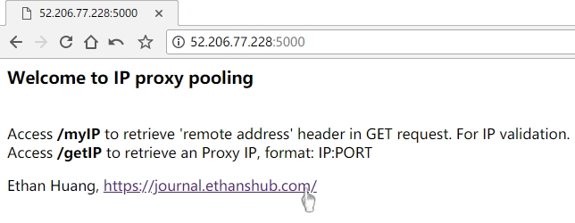
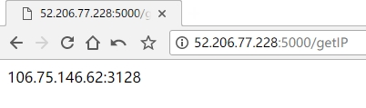

# ohIPPool

首先，有一份详细的介绍文档在我的博客：[实现增强版的代理IP池](https://journal.ethanshub.com/post/category/gong-cheng-shi/-python-pa-chong-dai-li-san)。

这是一个Python实现的动态的IP代理池，后端使用Redis存储，使用Flask提供轻量级的Web服务，通过简单的GET请求就可以获得一个有效的代理IP。



<p align = "center">Web页面-主页</p>



<p align = "center">web页面-获取一个IP</p>

## 使用

```
GET IP:PORT/getIP
```

其中`IP:PORT`是你部署这个池所在的机器的地址，大多数时候，你也需要配置该机器的安全策略以便外界的机器能够访问。

# 简单介绍

## 获取IP的retriever

`Configure.py`文件中的`RETRIEVER_INTERVAL`配置项决定了retriever的活动时间，默认为60s。每隔60s，retriever会判断池中有效IP的数量，如果其值小于`POOL_SIZE`就会进行补充。补充的来源目前来自己我花钱买的代理IP（5元10000个），也可以自己编写代码爬取免费的代理IP页面，或者自己编写自己的采集器，方式不重要。

## 保证IP的质量的validator

通过给每个IP计分的方式来标注IP的质量，从0开始，越大质量越高。`Configure.py`文件中的`POOL_IP_QUALITY`配置项决定了IP的质量阈值，它有`HIGH`, `MEDIUM`, `LOW`几个级别，默认是`MEDIUM`。由于IP是通过抓取免费代理网页或通过API批量获取的，理论上质量越高的IP越难找。

validator会每隔`VALIDATOR_INTERVAL`秒检查一下次当前进程池里分数低于`POOL_IP_QUALITY`的IP，为什么是这个值？因为之后cleaner会把所有分数低于`POOL_IP_QUALITY` 的IP清理掉，如果IP的分数高于`POOL_IP_QUALITY `，那么即使校验失败分数也不会因为低于阈值而被清理掉；同理，如果IP的分数低于`POOL_IP_QUALITY `，即使校验成功仍然会因为分数低于阈值而被清理掉；只有分数等于`POOL_IP_QUALITY `的IP，还有一次翻身的机会。

这里为什么不检查所有的IP？目的就是为了加速校验这个过程。当然这里也可以使用多线程或异步IO进行全局IP校验，这肯定是可以的。不过我的进程池很小，我就没这么做。当然如果进程池要很大的话，我个人推荐直接去购买相应的高质量代理IP服务。

判断一个IP是否有效，只需要任意用它访问一个页面，检查返回码是否为200即可。另外，我在webapi里提供了一个`/myIP`地址，访问的话，它会返回一个页面内容为请求头中`Remote Address`字段的值。


## 清理无效IP的cleaner

如果`cleaner`发现一个IP的分数低于阈值，那么这个IP就会被认为是无效的，会被清除掉。时间间隔是`CLEANER_INTERVAL`。


## 记录日志的logger

除了核心的部分，我还顺便实现了一个logger模块，它可以接受其他模块传来的日志，并根据配置项`LOG_TYPE`决定日志是作为标准输出至屏幕，还是写入文件。

日志分为三个级别`LOG_LEVEL_FINE`, `LOG_LEVEL_FINER`, `LOG_LEVEL_FINEST`，由产生日志的模块自行选择，但是配置项`LOG_LEVEL`决定输出哪个级别以该级别以上的日志，默认为`LOG_LEVEL_FINE`。

惭愧的是，写完这个logger之前，我不知道有[logging](https://docs.python.org/3/library/logging.html)模块的存在，惊了个呆。后来一想，反正我这个也能用，就留着没删。